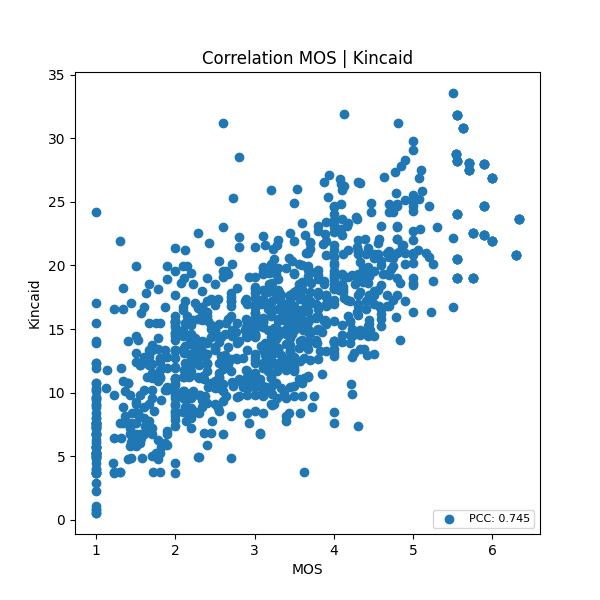

# Text Complexity Control
## Overview
This is the repo for the text complexity control project,
which aims to develop a controllable decoder model that generates German text at different complexity levels.
The repo contains:

- The adapters for multi-complexity-level text generation.
- The source code to train and evaluate the models.
- The evaluation results.

Note: The training data is from a private dataset and thus not provided in this repo.
Actually, any text dataset can be used as an alternative as the training process only requires some short query texts.

## Baseline Model
`ml6team/gpt2-small-german-finetune-oscar` is used as the baseline model.
Please download the model and save it under `./baseline_models/gpt2-german-oscar/CAUSAL_LM`

## Training Strategy
Basically, the baseline model parameters are frozen and the inserted `LoRA` adapter modules are trained on the stylistic
continuation task via `RLHF`.
### Stylistic Continuation
The first n tokens of a text sample will be fed into the model together with one of the following control tokens.
The model should extend the query text at a certain complexity level accordingly.

| Control Token        | Target Class      | Target Class ID |
|----------------------|-------------------|-----------------|
| \[Leichte Sprache\]  | Easy Language     | 0               |
| \[Einfache Sprache\] | Plain Language    | 1               |
| \[Alltagssprache\]   | Everyday Language | 2               |
| \[Fachsprache\]      | Special Language  | 3               |

Prompt template: `<ctrl token>: <query text>`

The multi-complexity-level generation task is first treated as four subtasks that correspond to a certain language level respectively.
When training each subtask, only one type of control token will be added in the front of the query text.
During the fusion of subadapters, control tokens are randomly sampled.

## Reward Modeling

### Regression Manner
In regression manner, the response reward is calculated as the difference between the response text simplicity score predicted by a regression model and a predefined baseline:
```math
response\_reward = (simplicity\_score - baseline) \cdot rescaling\_factor \cdot sign(target\_cls\_id)
```
```math
sign(target\_cls\_id) =
\begin{cases}
1& {target\_cls\_id \geq 2}\\
-1& {else}
\end{cases}
```

The optimization process can be regarded as shifting the text complexity distribution away from the baseline.

Ideally, a regression reward model should predict the human opinion toward the response text complexity.
Due to the scarcity of human feedback data, `Flesch–Kincaid Grade Level` is used as an approximation,
which is highly correlated to the real human feedback (**M**ean **O**pinion **S**core).

<p align="center">

</p>

### Classification Manner
In classification manner, the response text is classified into four categories i.e. easy, plain, everyday and special by the reward model.
The predicted logit corresponding to the control token i.e. target class is used as the response reward:
```math
response\_reward = target\_cls\_logit \cdot rescaling\_factor
```

The optimization process can be regarded as sharpening the text complexity distribution.

`krupper/text-complexity-classification` is selected as the classification reward model.